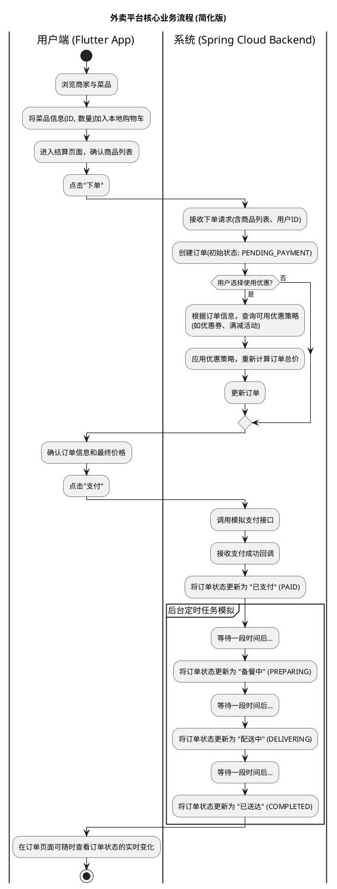

# 仿饿了么 Flutter 应用

本项目是一个为课程设计开发的、高度仿照饿了么核心功能的 Flutter 应用。它旨在展示一个现代、响应式且功能丰富的移动端订餐流程。

##  技术栈

- **框架**: [Flutter](https://flutter.dev/) 3.x
- **状态管理**: [Provider](https://pub.dev/packages/provider)
- **路由管理**: [GoRouter](https://pub.dev/packages/go_router)
- **UI 组件**: Material Design 3
- **HTTP 客户端 (预留)**: [Dio](https://pub.dev/packages/dio)
- **其他库**: `cached_network_image`, `intl`, `uuid`, 等.

## 业务流程




## 当前状态

**纯前端演示版**

目前，本项目为一个完整的纯前端应用。所有后端逻辑和数据交互均由一个内置的 **模拟 `ApiService`** (`lib/services/api_service.dart`) 提供支持。该服务通过返回硬编码的模拟数据并模拟网络延迟，使得应用可以在没有真实后端的情况下独立运行、测试和展示所有核心功能。

## 项目结构

项目代码遵循功能模块化的组织方式，结构清晰，易于维护和扩展。

```
lib/
├── config/         # 应用全局配置 (主题, 常量等)
├── models/         # 数据模型 (User, Shop, Order等)
├── pages/          # 应用页面 (按功能模块组织)
│   ├── auth/
│   ├── cart/
│   ├── home/
│   ├── order/
│   ├── profile/
│   └── shop/
├── providers/      # 状态管理器 (基于Provider)
├── routes/         # 路由配置 (GoRouter)
├── services/       # 服务层 (目前为模拟API服务)
└── widgets/        # 可复用的UI组件 (按功能模块组织)
```

## 已实现功能

- **用户模块**:
  - [x] 用户登录/注册页面（支持密码登录）
  - [x] 个人中心页面，根据登录状态动态展示
  - [x] 完整的地址管理（列表、新增、编辑、删除）

- **首页与商家**:
  - [x] 首页框架，包含底部导航栏（首页、订单、我的）
  - [x] 商家列表展示，支持下拉刷新
  - [x] 商家详情页，包含顶部伸缩头图和 Tab 切换（点餐、评价、商家）
  - [x] "点餐"页实现左侧分类与右侧菜品列表联动

- **购物车**:
  - [x] 在商家页面进行加、减商品的交互
  - [x] 底部悬浮购物车栏，实时显示总价和数量
  - [x] 独立的购物车页面，支持清空和修改商品数量

- **订单流程**:
  - [x] 从购物车到订单确认页的完整流程
  - [x] 订单确认页展示地址、商品清单和价格明细
  - [x] 订单列表页，按"全部"、"进行中"、"已完成"分类展示
  - [x] 订单详情页，展示订单状态、配送、价格、商品等完整信息

## 如何运行

1.  **克隆仓库**:
    ```bash
    git clone [your-repo-url]
    cd elm
    ```

2.  **获取依赖**:
    ```bash
    flutter pub get
    ```

3.  **运行应用**:
    ```bash
    flutter run
    ```

## 未来展望

- **后端对接**: 将 `ApiService` 替换为真实的 HTTP 请求，与 Spring Cloud 微服务后端进行对接。
- **功能完善**:
  - 实现搜索功能。
  - 实现用户评价功能。
  - 增加真实的地图和订单追踪。
- **UI/UX 优化**: 对页面细节进行打磨，增加更多动画效果，提升用户体验。

## 重要配置说明

### 后端API连接

本项目默认配置连接到后端API的URL为：`http://localhost:9000`

为解决Flutter Web开发模式下端口变动导致的CORS问题，我们在ApiService中固定了后端访问地址。如果需要修改后端地址，请编辑`lib/services/api_service.dart`文件中的`baseUrl`变量。

```dart
// 定义固定的后端URL，不管Flutter Web端口如何变动
static const String baseUrl = 'http://localhost:9000';
```

请确保后端服务配置了正确的CORS允许规则，例如：

```
Access-Control-Allow-Origin: http://localhost:*
```

或明确指定允许的端口:

```
Access-Control-Allow-Origin: http://localhost:9000
```

## API文档

API接口文档请参考`API.md`文件或`openapi.json`
