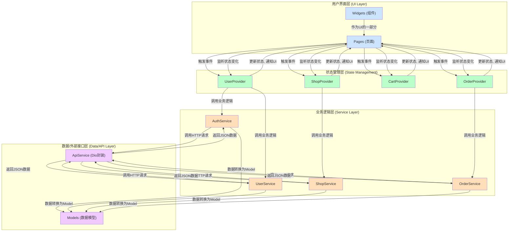

# 《饿了么》移动应用开发期末项目报告

---

### **摘要**

（此部分将简要介绍本项目的目标、核心功能、采用的主要技术以及最终实现的项目成果。旨在让读者快速了解项目的全貌。）

---

### **1. 项目背景与目标**

#### **1.1 项目背景**
- 随着移动互联网的普及，外卖订餐已成为人们日常生活的一部分。
- 本项目旨在通过模仿主流外卖平台"饿了么"，实践并巩固移动应用开发课程中所学的知识。

#### **1.2 项目目标**
- **功能目标**：实现一个包含用户认证、商家浏览、在线点餐、购物车管理、订单生成与查看等核心功能的外卖APP。
- **技术目标**：
    - 熟练运用 Flutter 框架构建跨平台应用。
    - 采用 Provider 进行应用状态管理，构建清晰的数据流。
    - 设计并实现分层的应用架构（UI、业务逻辑、数据服务）。
    - 掌握路由管理、异步编程、数据持久化等关键技术。
- **学习目标**：完整体验一个商业级应用的开发流程，从需求分析、技术选型到编码实现和测试。

---

### **2. 系统设计**

#### **2.1 总体架构设计**

为确保项目的可维护性、可扩展性和高内聚低耦合，本项目采用了经典的分层架构模式，并结合`Provider`进行状态管理。整个应用从上至下分为四层：表现层 (UI)、状态管理层 (Providers)、业务逻辑层 (Services) 和数据层 (Data/API)。

*   **表现层 (UI Layer)**: 位于 `lib/pages` 和 `lib/widgets` 目录。由 Flutter 的 Widget 构成，负责应用的界面渲染和用户交互的捕获。该层是"被动"的，它仅监听状态管理层的变化来更新自己，并将用户的操作事件传递给状态管理层。
*   **状态管理层 (State Management Layer)**: 位于 `lib/providers` 目录。这是连接UI和业务逻辑的核心枢纽。本项目使用 `Provider` 包，通过 `ChangeNotifierProvider` 来创建和管理不同模块的状态。例如，`CartProvider` 维护购物车的状态，当状态变更时（如添加商品），它会调用 `notifyListeners()` 来通知监听它的UI组件进行刷新。这种方式有效地将UI和业务逻辑解耦。
*   **业务逻辑层 (Service Layer)**: 位于 `lib/services` 目录。该层包含了应用的核心业务逻辑，独立于UI。它负责处理由状态管理层发起的业务请求，例如用户认证、数据获取、订单创建等。服务层会调用数据层来与外部API进行交互。
*   **数据层 (Data Layer)**: 位于 `lib/models` 目录和 `lib/services/api_service.dart`。`Models` 目录定义了项目中使用到的所有数据实体类（如 `User`, `Shop`, `Order`），并包含 `fromJson` / `toJson` 方法用于数据序列化。`ApiService` 则是对 `dio` 库的封装，是与后端API进行HTTP通信的具体实现。

#### **2.2 功能模块设计**
项目的核心功能围绕用户点餐的完整流程展开，具体模块划分如下：
- **用户模块**: 
    - **核心文件**: `login_page.dart`, `profile_page.dart`, `address_list_page.dart`, `coupons_page.dart`, `user_provider.dart`, `auth_service.dart`, `user_service.dart`。
    - **功能描述**: 实现了用户的登录、登出，个人信息的展示，以及收货地址和优惠券的管理。`UserProvider` 负责维护用户的登录状态和基本信息。
- **首页与商家模块**: 
    - **核心文件**: `home_tab.dart`, `shop_page.dart`, `shop_list_item.dart`, `shop_provider.dart`, `shop_service.dart`。
    - **功能描述**: 应用的入口，负责展示基于特定条件（如地理位置）的商家列表。用户可以点击商家进入详情页，浏览该商家的菜单、评价和详细信息。`ShopProvider` 负责获取和管理商家列表及单个商家的详细数据。
- **点餐与购物车模块**: 
    - **核心文件**: `shop_menu_tab.dart`, `cart_page.dart`, `cart_bar.dart`, `cart_provider.dart`。
    - **功能描述**: 用户在商家菜单中将商品添加入购物车。`CartProvider` 作为全局状态管理器，负责维护购物车内的数据，确保在不同页面（如商家页、购物车页）的数据同步。`CartBar` 是一个常驻底部的组件，实时显示购物车状态并提供结算入口。
- **订单模块**:
    - **核心文件**: `order_confirmation_page.dart`, `payment_page.dart`, `orders_page.dart`, `order_details_page.dart`, `order_provider.dart`, `order_service.dart`。
    - **功能描述**: 实现了从购物车到订单的完整流程。用户在订单确认页选择地址和优惠，提交后进入模拟支付，最终生成订单。用户可以在个人中心查看所有历史订单及其详情。`OrderProvider` 负责处理订单的创建、查询和状态更新。

#### **2.3 数据模型设计**
为了清晰地表示和传递数据，项目设计了以下核心数据模型：
- **`User`**: 存储用户的ID、用户名、头像、联系方式等基本信息。
- **`Shop`**: 描述商家的完整信息，包括列表展示所需的摘要信息（店名、评分、logo）和详情页所需的详细信息（地址、公告、营业时间等）。
- **`Food`**: 定义了单个菜品的属性，包括名称、价格、描述、图片URL和月销量等。
- **`Cart`**: 核心的购物车数据结构。它与单个商家绑定，并包含一个 `CartItem` 列表。`Cart` 类自身也能计算商品总价。
- **`Address`**: 用户的收货地址模型，包含收货人、电话、省市区和详细门牌号。
- **`Order`**: 结构最复杂的模型之一，记录了订单的完整信息，包括订单号、状态、商品列表 (`OrderItem`)、支付金额、折扣、收货人信息和时间戳等。
- **`Promotion`**: 定义了优惠活动（如满减）和用户优惠券（`UserCoupon`）的数据结构。

#### **2.4 技术选型**
本项目的技术选型旨在平衡开发效率、性能和可维护性：
- **开发框架 (Flutter)**: 选用 Flutter 是因为它出色的跨平台能力（一套代码，多端运行）、富有表现力的UI构建方式以及接近原生的性能。
- **编程语言 (Dart)**: 作为 Flutter 的官方语言，Dart 提供了类型安全、AOT/JIT编译模式和丰富的异步支持，非常适合现代响应式应用的开发。
- **状态管理 (`provider`)**: 选用 `provider` 是因为它是由官方推荐的、轻量级且易于理解的状态管理方案。它能够清晰地分离UI和业务逻辑，有效避免了复杂的组件树回调。
- **路由管理 (`go_router`)**: 相比Flutter内置的路由，`go_router` 提供了基于URL的声明式路由，简化了页面导航、深链接（Deep Linking）和参数传递，使路由逻辑更加健壮和集中化。
- **UI 适配 (`flutter_screenutil`)**: 为确保UI在不同尺寸和分辨率的设备上都能保持一致的视觉效果，使用了该库进行像素级别的适配。
- **网络请求 (`dio`)**: `dio` 是一个功能强大的Dart HTTP客户端，支持拦截器、请求取消、文件上传下载等高级功能，使得与后端API的交互更加灵活和可控。
- **其他关键库**: `cached_network_image` 用于高效地加载和缓存网络图片，提升列表滚动的流畅度；`carousel_slider` 用于在商家详情页实现图片轮播效果。

---

### **3. 系统核心功能实现**

这一部分将详细阐述项目中的关键技术和核心功能的具体实现方法，并结合代码示例进行说明。

#### **3.1 状态管理机制**

项目采用`provider`包作为核心的状态管理方案。其核心思想是通过`ChangeNotifierProvider`在Widget树的上层注入状态管理器（即Provider），然后在下层UI组件中通过`Consumer`、`context.watch`或`context.read`来监听和读取状态，从而实现UI与业务逻辑的解耦。

所有的Provider（如`UserProvider`, `CartProvider`等）都在`main.dart`的`MultiProvider`中进行注册，确保了它们在整个应用的生命周期内是全局可访问的单例。

- **工作流程示例（添加商品到购物车）**:
    1.  **用户交互**: 在商家菜单页(`lib/pages/shop/shop_menu_tab.dart`)，用户点击"+"按钮。
    2.  **触发事件**: 该按钮的`onTap`回调函数会执行 `Provider.of<CartProvider>(context, listen: false).addToCart(food, shop);`。这里使用`listen: false`是因为这个操作只是为了触发一个动作，而不是监听状态变化。
    3.  **状态更新**: `CartProvider`中的`addToCart`方法会更新内部的`_cart`对象，然后调用`notifyListeners()`。这是关键一步，它会通知所有正在"监听"`CartProvider`的组件进行重绘。
    4.  **UI响应**:
        - 在商家页面底部的结算栏(`lib/widgets/shop/cart_bar.dart`)中，使用了`Consumer<CartProvider>`来构建UI。当`notifyListeners()`被调用时，`Consumer`的`builder`会重新执行，从而实时更新购物车中的商品总数和总价。
        - 当用户跳转到购物车页面(`lib/pages/cart/cart_page.dart`)时，该页面同样会从`CartProvider`中读取最新的购物车数据来展示商品列表。

通过这种方式，`CartProvider`成为了购物车数据的唯一可信来源，任何对购物车的修改都集中在此处，而所有关心购物车状态的UI组件都能自动、高效地得到更新，避免了复杂的组件间参数传递和回调地狱。

#### **3.2 路由设计与实现**

项目采用`go_router`进行路由管理，它提供了基于URL的声明式路由方案，使得导航逻辑更加清晰和健壮。

所有路由都在`lib/routes/app_routes.dart`文件中集中配置，通过`GoRoute`将路径（如`/shop/:id`）与页面组件（如`ShopPage`）进行映射。

- **核心优势**:
    - **参数传递**: 支持通过路径参数（如`:id`）、查询参数和`extra`对象来传递数据。
    - **深层链接**: 天然支持通过URL直接跳转到应用内指定页面。
    - **路由守卫**: 可以通过`redirect`逻辑实现权限控制，例如，在`home_page.dart`中，当用户未登录时尝试访问订单页，会被重定向到登录页。

- **工作流程示例（查看商家 -> 下单 -> 支付）**:
    1.  **进入商家详情**: 在首页列表点击某个商家，触发`context.push(AppRoutes.shop, extra: shop)`。`go_router`根据配置，导航到`ShopPage`，并将`shop`对象通过`extra`参数传递过去。
    2.  **进入订单确认**: 在商家页的结算栏点击"去结算"，触发`context.push(AppRoutes.orderConfirmation)`。此时无需传参，因为订单确认页会直接从全局的`CartProvider`获取购物车数据。
    3.  **提交订单并进入支付**: 在订单确认页点击"提交订单"，会先调用`OrderProvider`的`createOrder`方法创建一个预订单，成功后，使用`context.go(AppRoutes.payment, extra: order.id)`进行跳转。`go`方法会替换当前的路由栈，防止用户返回订单确认页。同时，将新生成的订单ID通过`extra`传递给支付页。
    4.  **完成支付并查看详情**: 支付成功后，通过`context.go('${AppRoutes.orderDetail}/${_order!.id}')`跳转到订单详情页。这里的`orderId`是通过路径参数传递的，`go_router`会解析该路径并将其作为参数传递给`OrderDetailsPage`。

#### **3.3 异步数据流处理**

应用中大量的页面数据（如商家列表、订单详情）都依赖网络请求。项目为此建立了一套标准的异步数据处理流程，以`Provider`作为中介，实现了加载状态的清晰管理。

- **典型流程**: **UI触发 -> Provider方法 -> Service方法 -> ApiService(Dio) -> Service处理响应 -> Provider更新状态 -> UI重绘**

- **工作流程示例（首页加载附近商家）**:
    1.  **UI触发**: `HomeTab`组件在`initState`或下拉刷新时，调用其内部的`_fetchShops`方法。
    2.  **启动加载**: `_fetchShops`方法首先在页面级别设置`_isLoading = true`来显示一个占位加载动画，然后调用`Provider.of<ShopProvider>(context, listen: false).getNearbyShops()`。
    3.  **Provider处理**: `ShopProvider`的`getNearbyShops`方法会设置自身的`isLoading`为`true`并调用`notifyListeners()`，然后调用`_shopService.getNearbyShops()`来执行具体的业务逻辑。
    4.  **Service执行**: `ShopService`调用封装了`dio`的`ApiService`发起HTTP请求。
    5.  **数据返回与解析**: `ApiService`返回JSON数据后，`ShopService`负责将其解析成`List<Shop>`数据模型列表。
    6.  **Provider更新**: `ShopProvider`拿到`List<Shop>`数据后，更新自己的`_shops`列表，将`isLoading`标志位置为`false`，并再次调用`notifyListeners()`。
    7.  **UI重绘**: `HomeTab`中用于显示商家列表的`_buildShopList`方法被包裹在`Consumer<ShopProvider>`中。当监听到`ShopProvider`的状态变化时，`Consumer`会重新构建其子组件。此时它会检查`shopProvider.isLoading`（已为false）和`shopProvider.shops`（已有数据），最终将商家列表渲染到屏幕上。如果过程中发生错误，`error`信息也会被保存在`ShopProvider`中，UI会相应地显示错误提示。

#### **3.4 UI/UX 设计与实现**

为了提供高质量且统一的用户体验，项目在UI/UX方面做了诸多设计。

- **全局主题与样式 (`lib/config/app_theme.dart`)**:
    - 项目定义了`AppTheme`类来统一管理应用的视觉风格。这包括了基础色板（如`primaryColor`）、背景色、文本颜色等。
    - 通过配置`ThemeData`，为常用组件如`ElevatedButton`、`AppBar`、`InputDecoration`等设置了全局默认样式，确保了应用整体风格的一致性，也极大减少了在单个组件中重复编写样式代码的工作量。

- **屏幕适配 (`lib/config/app_config.dart`)**:
    - 项目引入`flutter_screenutil`库来解决UI在不同尺寸设备上的适配问题。在`AppConfig`中设定设计稿的基准宽高，并在应用启动时初始化`ScreenUtil`。
    - 在布局时，通过`.w`, `.h`, `.sp`等扩展方法，可以方便地将设计稿上的尺寸和字号转换为在当前设备上等比缩放的逻辑像素值，保证了UI在各种屏幕上都能按预期比例显示。

- **高度复用的自定义组件 (`lib/widgets/`)**:
    - **`ShopListItem`**: 用于在首页展示商家信息的卡片。它被设计成一个独立的、可复用的组件，仅接收一个`Shop`对象作为输入，内部封装了所有展示逻辑。
    - **`CartBar`**: 常驻在商家详情页底部的结算栏。它是一个典型的"智能"组件，通过`Consumer`主动监听`CartProvider`的变化，并根据购物车是否为空来自动显示或隐藏，实时更新总价。
    - **`EmptyPlaceholder`**: 一个通用的空状态占位组件，可自定义图标和提示文案，用于列表为空、加载失败等场景，提供了比空白屏幕更友好的用户反馈。

- **增强体验的动画效果**:
    - 在首页商家列表的展示中，使用了`flutter_staggered_animations`库，为列表项添加了优雅的交错淡入和滑动动画，避免了数据加载完成时页面的生硬刷新。
    - 在商家详情页，使用`carousel_slider`实现了顶部图片的自动轮播。
    - 在商家详情页的`SliverAppBar`中，通过监听滚动偏移量，并结合`AnimatedOpacity`实现了导航栏标题在用户上滑时平滑淡入的效果，提升了交互的精致感。

---

### **4. 项目总结与展望**

#### **4.1 项目完成度**
- 总结项目目标的完成情况，已成功实现绝大部分预定功能。

#### **4.2 项目亮点**
- **架构清晰**：分层架构使得代码易于维护和扩展。
- **状态管理高效**：`Provider` 的使用有效解耦了UI和业务逻辑。
- **用户体验良好**：界面美观，交互流畅，关键操作（如点餐）路径清晰。

#### **4.3 遇到的问题与解决方案**
- **问题1**：跨页面状态同步。例如，在多个页面都需要展示和操作购物车数据。
    - **解决方案**：使用 `CartProvider` 作为全局单例，在根节点注入，任何子页面都可以访问和修改购物车状态并获得实时更新。
- **问题2**：复杂的页面UI与交互。例如，商家页面的左右联动菜单。
    - **解决方案**：通过 `ScrollController` 监听右侧食品列表的滚动，动态计算当前所在的分类，并更新左侧分类列表的选中状态。

#### **4.4 不足与未来展望**
- **功能待完善**：真实的支付接口、实时订单配送跟踪、用户评价系统等功能尚未实现。
- **性能优化**：对于长列表可以引入更高级的懒加载和回收机制。
- **代码健壮性**：可以增加更多的单元测试和集成测试。

---

### **致谢**

（感谢指导老师在课程中的悉心教导...）

---
